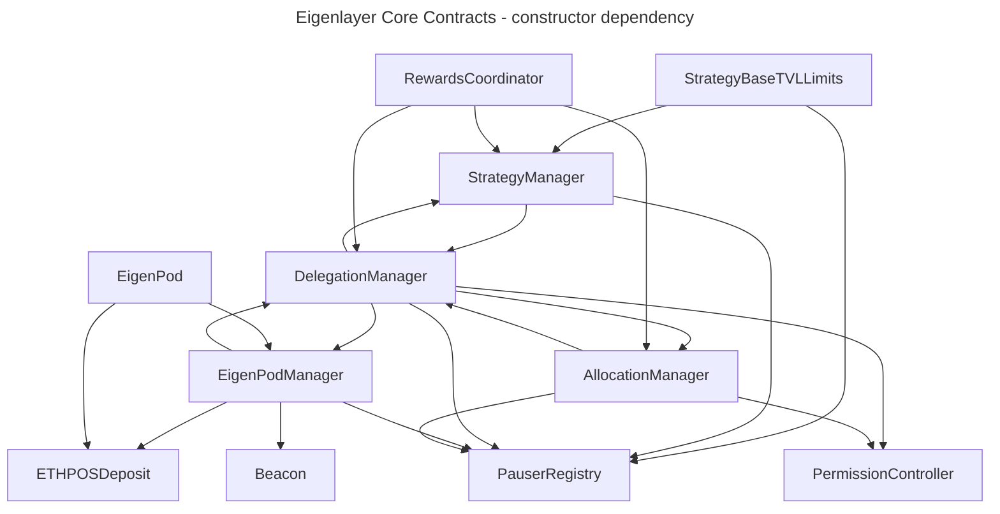
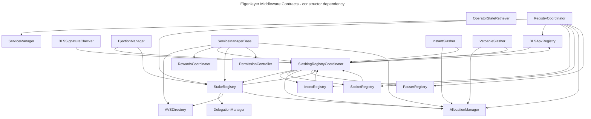

# Eigenlayer

## Eigenlayer Core Contracts

```mermaid
---
title: Eigenlayer Core Contracts - constructor dependency
---
flowchart TD
    %% StrategyBaseTVLLimits
    StrategyBaseTVLLimits --> StrategyManager
    StrategyBaseTVLLimits --> PauserRegistry

    %% StrategyManager
    StrategyManager --> DelegationManager
    StrategyManager --> PauserRegistry

    %% DelegationManager
    DelegationManager --> StrategyManager
    DelegationManager --> EigenPodManager
    DelegationManager --> AllocationManager
    DelegationManager --> PauserRegistry
    DelegationManager --> PermissionController

    %% EigenPodManager
    EigenPodManager --> ETHPOSDeposit
    EigenPodManager --> Beacon
    EigenPodManager --> DelegationManager
    EigenPodManager --> PauserRegistry

    %% AllocationManager
    AllocationManager --> DelegationManager
    AllocationManager --> PauserRegistry
    AllocationManager --> PermissionController

    %% EigenPod
    EigenPod --> ETHPOSDeposit
    EigenPod --> EigenPodManager

    %% RewardsCoordinator
    RewardsCoordinator --> DelegationManager
    RewardsCoordinator --> StrategyManager
    RewardsCoordinator --> AllocationManager

```

## Eigenlayer Middleware Contracts

```mermaid
---
title: Eigenlayer Middleware Contracts - constructor dependency
---
flowchart TD
    %% BLSApkRegistry
    BLSApkRegistry --> SlashingRegistryCoordinator

    %% BLSSignatureChecker
    BLSSignatureChecker --> SlashingRegistryCoordinator

    %% EjectionManager
    EjectionManager --> SlashingRegistryCoordinator
    EjectionManager --> StakeRegistry
    
    %% IndexRegistry
    IndexRegistry --> SlashingRegistryCoordinator

    %% OperatorStateRetriever
    OperatorStateRetriever

    %% RegistryCoordinator
    RegistryCoordinator --> ServiceManager
    RegistryCoordinator --> StakeRegistry
    RegistryCoordinator --> BLSApkRegistry
    RegistryCoordinator --> IndexRegistry
    RegistryCoordinator --> SocketRegistry
    RegistryCoordinator --> AllocationManager
    RegistryCoordinator --> PauserRegistry

    %% ServiceManagerBase
    ServiceManagerBase --> AVSDirectory
    ServiceManagerBase --> RewardsCoordinator
    ServiceManagerBase --> SlashingRegistryCoordinator
    ServiceManagerBase --> StakeRegistry
    ServiceManagerBase --> PermissionController
    ServiceManagerBase --> AllocationManager

    %% SlashingRegistryCoordinator
    SlashingRegistryCoordinator --> StakeRegistry
    SlashingRegistryCoordinator --> BLSApkRegistry
    SlashingRegistryCoordinator --> IndexRegistry
    SlashingRegistryCoordinator --> SocketRegistry
    SlashingRegistryCoordinator --> AllocationManager
    SlashingRegistryCoordinator --> PauserRegistry

    %% SocketRegistry
    SocketRegistry --> SlashingRegistryCoordinator

    %% StakeRegistry
    StakeRegistry --> SlashingRegistryCoordinator
    StakeRegistry --> DelegationManager
    StakeRegistry --> AVSDirectory
    StakeRegistry --> AllocationManager

    %% InstantSlasher
    InstantSlasher --> AllocationManager
    InstantSlasher --> SlashingRegistryCoordinator

    %% VetoableSlasher
    VetoableSlasher --> AllocationManager
    VetoableSlasher --> SlashingRegistryCoordinator
```

## Eigenlayer All

```mermaid
---
title: Eigenlayer All - constructor dependency
---
flowchart TD
    %% core
    %% StrategyBaseTVLLimits
    StrategyBaseTVLLimits --> StrategyManager
    StrategyBaseTVLLimits --> PauserRegistry

    %% StrategyManager
    StrategyManager --> DelegationManager
    StrategyManager --> PauserRegistry

    %% DelegationManager
    DelegationManager --> StrategyManager
    DelegationManager --> EigenPodManager
    DelegationManager --> AllocationManager
    DelegationManager --> PauserRegistry
    DelegationManager --> PermissionController

    %% EigenPodManager
    EigenPodManager --> ETHPOSDeposit
    EigenPodManager --> Beacon
    EigenPodManager --> DelegationManager
    EigenPodManager --> PauserRegistry

    %% AllocationManager
    AllocationManager --> DelegationManager
    AllocationManager --> PauserRegistry
    AllocationManager --> PermissionController

    %% EigenPod
    EigenPod --> ETHPOSDeposit
    EigenPod --> EigenPodManager

    %% RewardsCoordinator
    RewardsCoordinator --> DelegationManager
    RewardsCoordinator --> StrategyManager
    RewardsCoordinator --> AllocationManager

%% middleware
    %% BLSApkRegistry
    BLSApkRegistry --> SlashingRegistryCoordinator

    %% BLSSignatureChecker
    BLSSignatureChecker --> SlashingRegistryCoordinator

    %% EjectionManager
    EjectionManager --> SlashingRegistryCoordinator
    EjectionManager --> StakeRegistry
    
    %% IndexRegistry
    IndexRegistry --> SlashingRegistryCoordinator

    %% OperatorStateRetriever
    OperatorStateRetriever

    %% RegistryCoordinator
    RegistryCoordinator --> ServiceManager
    RegistryCoordinator --> StakeRegistry
    RegistryCoordinator --> BLSApkRegistry
    RegistryCoordinator --> IndexRegistry
    RegistryCoordinator --> SocketRegistry
    RegistryCoordinator --> AllocationManager
    RegistryCoordinator --> PauserRegistry

    %% ServiceManagerBase
    ServiceManagerBase --> AVSDirectory
    ServiceManagerBase --> RewardsCoordinator
    ServiceManagerBase --> SlashingRegistryCoordinator
    ServiceManagerBase --> StakeRegistry
    ServiceManagerBase --> PermissionController
    ServiceManagerBase --> AllocationManager

    %% SlashingRegistryCoordinator
    SlashingRegistryCoordinator --> StakeRegistry
    SlashingRegistryCoordinator --> BLSApkRegistry
    SlashingRegistryCoordinator --> IndexRegistry
    SlashingRegistryCoordinator --> SocketRegistry
    SlashingRegistryCoordinator --> AllocationManager
    SlashingRegistryCoordinator --> PauserRegistry

    %% SocketRegistry
    SocketRegistry --> SlashingRegistryCoordinator

    %% StakeRegistry
    StakeRegistry --> SlashingRegistryCoordinator
    StakeRegistry --> DelegationManager
    StakeRegistry --> AVSDirectory
    StakeRegistry --> AllocationManager

    %% InstantSlasher
    InstantSlasher --> AllocationManager
    InstantSlasher --> SlashingRegistryCoordinator

    %% VetoableSlasher
    VetoableSlasher --> AllocationManager
    VetoableSlasher --> SlashingRegistryCoordinator

```